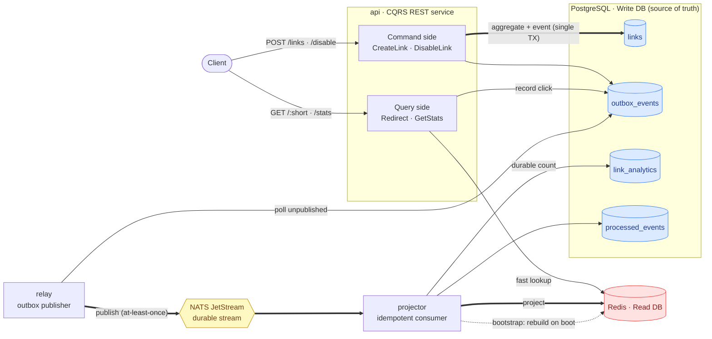

<div align="center">

# 🔗 URL Shortener + Analytics

### A production-grade URL shortener built with **CQRS** & **Domain-Driven Design**

Separate write/read databases · Transactional Outbox · durable event streaming · a fully rebuildable read model.


</div>

---

A simplified Bitly-style service that shortens URLs, redirects visitors, and tracks click
analytics — implemented with **command/query separation backed by two different databases**.
Every redirect emits a durable `LinkClicked` event; a projector updates the read model
asynchronously (eventual consistency). Because events flow through a **Transactional Outbox +
NATS JetStream**, no event is ever lost, and the entire read store can be wiped and rebuilt
from the durable source of truth.

## ✨ Highlights

- **True CQRS** — the write side (PostgreSQL) and the read side (Redis) are physically separate, optimized for opposite workloads.
- **No lost events** — the Transactional Outbox writes aggregate state *and* its events in one DB transaction, eliminating the dual-write problem.
- **Exactly-once effects** — the projector is idempotent (event de-duplication), so at-least-once delivery never double-counts a click.
- **Disposable read model** — Redis can be flushed entirely; the projector rebuilds it from PostgreSQL on boot. *(verified end-to-end)*
- **Clean DDD core** — a rich `Link` aggregate with invariants, self-validating value objects, and domain events — fully persistence-ignorant.
- **Hexagonal layout** — the domain depends on nothing; infrastructure plugs in through ports.

## 🚀 Features

| | Capability | Endpoint |
|---|---|---|
| 1 | Create a short link | `POST /links` |
| 2 | Disable a link | `POST /links/:short/disable` |
| 3 | Redirect to the original URL | `GET /:short` |
| 4 | View per-link click analytics | `GET /links/:short/stats` |

## 🏗️ Architecture

Three independent processes (built from one image) sit on top of three data backends:



| Component | Role |
|---|---|
| **api** | Serves both command (`POST`) and query (`GET`) sides, kept as two distinct layers in code. |
| **PostgreSQL** | Write DB / source of truth: aggregate state, outbox, durable click counts, dedup table. |
| **relay** | Polls the outbox and republishes events to JetStream (publishing half of the outbox pattern). |
| **NATS JetStream** | Durable, file-backed stream with at-least-once delivery and server-side de-duplication. |
| **projector** | Idempotent consumer; maintains the durable count in Postgres + the fast counters in Redis; rebuilds Redis on startup. |
| **Redis** | Read DB: `short → long` mapping and click counters for O(1) reads. |

### How a single click survives everything

```mermaid
sequenceDiagram
    autonumber
    actor C as Client
    participant A as api (Query)
    participant R as Redis (Read DB)
    participant O as Outbox (Postgres)
    participant L as relay
    participant J as JetStream
    participant P as projector

    C->>A: GET /{short}
    A->>R: GET link:{short}
    R-->>A: long URL
    A->>O: INSERT LinkClicked (durable)
    A-->>C: 302 Redirect
    Note over A,C: hot path stays fast; counting is async
    L->>O: poll unpublished
    L->>J: publish LinkClicked
    J->>P: deliver
    P->>P: idempotent increment (dedup by event id)
    P->>R: SET clicks:{short}
```

## 🧱 Project structure (Hexagonal / Onion)

```text
internal/
  domain/                       # pure core — zero infrastructure deps
    link/                       # Link aggregate, value objects, domain events, errors, repository port
    shared/                     # DomainEvent contract
  application/                  # use cases (CQRS)
    command/                    # CreateLink · DisableLink · RecordClick
    query/                      # Redirect · GetStats
    port/                       # outbound ports (read model, outbox, analytics, link reader)
  infrastructure/               # adapters
    persistence/postgres/       # GORM write store + transactional outbox + analytics
    persistence/redis/          # read-model adapter
    messaging/jetstream/        # publisher + durable consumer
    relay/  projector/          # outbox→bus  /  bus→read-model
    event/  config/  logger/
  interfaces/http/              # Gin handlers, router, domain-error → HTTP mapping
cmd/
  api/  relay/  projector/      # three binaries, one image
```

> The domain is **persistence-ignorant**: GORM tags live only in the Postgres adapter and are
> mapped to/from the aggregate. The domain layer imports nothing from infrastructure.

## 🗄️ Data model

**PostgreSQL (Write DB)**

| Table | Purpose |
|---|---|
| `links` | Aggregate state (`short_code`, `long_url`, `status`, `version`) |
| `outbox_events` | Durable event queue (Transactional Outbox) |
| `link_analytics` | Durable click counter — **source of truth** for stats |
| `processed_events` | Consumed event ids — projector idempotency |

**Redis (Read DB)**

| Key | Value |
|---|---|
| `link:{short}` | original URL (redirect fast path) |
| `clicks:{short}` | click counter (stats fast path) |

## ⚡ Quick start

```bash
docker compose up -d --build
```

Brings up `postgres`, `redis`, `nats`, `api`, `relay`, and `projector`. Data persists across
restarts via named volumes (Postgres + Redis AOF + JetStream file storage).

```bash
# 1) create a short link
curl -s -XPOST localhost:8080/links \
     -H 'Content-Type: application/json' \
     -d '{"url":"https://example.com/some/long/path"}'
# → {"short_code":"Ab3X9kZ","long_url":"https://example.com/some/long/path",
#    "short_url":"http://localhost:8080/Ab3X9kZ"}

# 2) follow it (records a click)
curl -s -i localhost:8080/Ab3X9kZ            # 302 → Location: https://example.com/...

# 3) read analytics (eventually consistent)
curl -s localhost:8080/links/Ab3X9kZ/stats   # {"short_code":"Ab3X9kZ","clicks":1}

# 4) disable it
curl -s -XPOST localhost:8080/links/Ab3X9kZ/disable   # {"status":"disabled"}
```

## 📡 API reference

| Method | Path | Description | Success | Errors |
|---|---|---|---|---|
| `POST` | `/links` | Create a link (`{"url":"..."}`) | `201` | `400` invalid URL |
| `POST` | `/links/:short/disable` | Disable a link | `200` | `404`, `409` already disabled |
| `GET` | `/:short` | Redirect to the original URL | `302` | `404` not found / disabled |
| `GET` | `/links/:short/stats` | Click count | `200` | `404` |
| `GET` | `/healthz` | Liveness probe | `200` | — |

A ready-to-use Postman collection is available in [`postman_collection.json`](postman_collection.json).

## 🛡️ Reliability & guarantees

- **Atomicity** — aggregate state and its domain events are committed in the *same* PostgreSQL transaction (Transactional Outbox), so the write store and the event log can never diverge.
- **At-least-once delivery** — `relay` marks an outbox row as published only after a successful publish; a crash mid-batch simply replays.
- **Idempotency** — the projector records each `event_id` in `processed_events` inside the same transaction as the counter increment, so duplicates can't double-count.
- **Durability & rebuildability** — PostgreSQL is the source of truth; Redis is a disposable projection. Flushing Redis and restarting the projector fully restores the read model from Postgres.

## ⚙️ Configuration

All settings come from environment variables (with docker-friendly defaults in
`internal/infrastructure/config`):

`HTTP_ADDR` · `POSTGRES_DSN` · `REDIS_ADDR` · `REDIS_PASSWORD` · `NATS_URL` · `BASE_URL` ·
`RELAY_POLL_INTERVAL` · `RELAY_BATCH_SIZE`

## 🧪 Tests

```bash
go test ./...
```

Covers value-object validation, aggregate behavior and invariants, application handlers
(with in-memory fakes), and HTTP routing (registration + redirect/stats behavior).

## 📚 Docs

- A detailed design report (Persian) lives in [`docs/REPORT.md`](docs/REPORT.md).
- The approved design spec is in [`docs/superpowers/specs/`](docs/superpowers/specs).

---

<div align="center">
Built with Go · CQRS · DDD · Hexagonal Architecture
</div>
