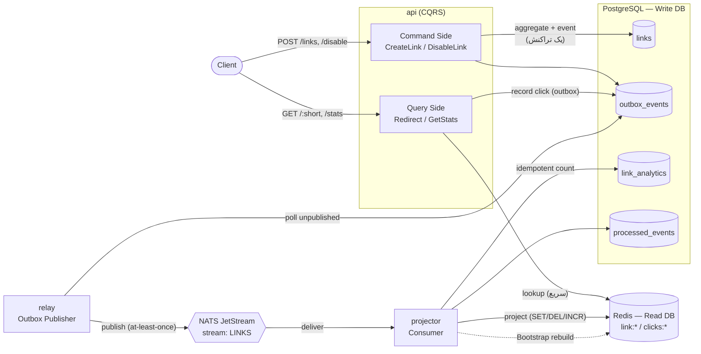
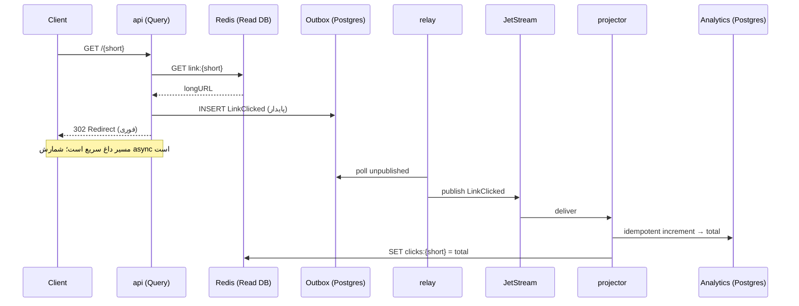

# گزارش تمرین سوم — سامانهٔ کوتاه‌کنندهٔ لینک با معماری CQRS و DDD

**درس:** طراحی سامانه‌های میکروسرویس — مبحث Domain-Driven Design
**موضوع:** پیاده‌سازی URL Shortener + Analytics با تفکیک Command/Query و دو دیتابیس مجزا

---

## ۱. خلاصهٔ اجرایی

در این تمرین یک نسخهٔ سادهٔ سامانهٔ کوتاه‌کنندهٔ لینک (مشابه Bitly) پیاده‌سازی شده که چهار قابلیت دارد:

۱. ایجاد لینک کوتاه
۲. غیرفعال‌کردن لینک
۳. هدایت (Redirect) از لینک کوتاه به لینک اصلی
۴. مشاهدهٔ آمار کلیک هر لینک

معماری بر پایهٔ **CQRS** (تفکیک کامل مسیر نوشتن از مسیر خواندن) و **DDD تاکتیکی** با چیدمان **Hexagonal/Onion** ساخته شده است. برای آنکه «هیچ رویدادی گم نشود» و «داده‌ها پس از ری‌استارت پایدار بمانند»، از الگوی **Transactional Outbox** به‌همراه **NATS JetStream** استفاده شده و خوانده‌مدل (Read Model) به‌صورت کامل از روی منبع حقیقت (Postgres) **بازسازی‌پذیر** است.

| لایه | فناوری | نقش |
|---|---|---|
| Write DB | PostgreSQL | منبع حقیقت: وضعیت aggregate، outbox، شمارندهٔ پایدار کلیک |
| Read DB | Redis | خوانده‌مدل سریع: نگاشت `shortCode→longURL` و شمارندهٔ کلیک |
| Message Bus | NATS JetStream | استریم بادوام رویدادها (تحویل at-least-once) |
| زبان | Go 1.25 | سه باینری: `api`, `relay`, `projector` |
| HTTP | Gin | REST API |

---

## ۲. مفاهیم CQRS و دلیل تفکیک Write DB / Read DB

### ۲.۱. CQRS چیست؟

**CQRS** (Command Query Responsibility Segregation) یعنی جداکردن مسئولیت **فرمان‌ها (Commands)** که حالت سیستم را تغییر می‌دهند، از **پرس‌وجوها (Queries)** که فقط داده می‌خوانند.

- **Command:** نیت تغییر حالت را بیان می‌کند (مثلاً «این لینک را بساز»، «این لینک را غیرفعال کن»). فرمان‌ها هیچ داده‌ای برنمی‌گردانند جز نتیجهٔ موفقیت/شکست.
- **Query:** فقط داده می‌خواند و هیچ‌گاه حالت دامنه را تغییر نمی‌دهد (side-effect-free).

در این پروژه این تفکیک حتی در سطح کد هم آشکار است:
- سمت نوشتن: `internal/application/command/` (هندلرهای `CreateLink`, `DisableLink`, `RecordClick`).
- سمت خواندن: `internal/application/query/` (هندلرهای `Redirect`, `GetStats`).

### ۲.۲. چرا دو دیتابیس مجزا؟

| دلیل | توضیح |
|---|---|
| **بهینه‌سازی مستقل مدل‌ها** | مدل نوشتن باید قواعد دامنه و یکپارچگی تراکنشی را رعایت کند (Postgres رابطه‌ای). مدل خواندن باید فقط سریع باشد؛ Redis با دسترسی O(1) برای redirect و شمارش ایده‌آل است. |
| **مقیاس‌پذیری ناهم‌سان** | تعداد redirectها (خواندن) معمولاً چند مرتبه بزرگ‌تر از ساخت لینک (نوشتن) است. با دو ذخیره‌گاه می‌توان هر سمت را جداگانه مقیاس داد. |
| **کاهش رقابت (contention)** | بار سنگین خواندن، تراکنش‌های نوشتن را کند نمی‌کند و برعکس. |
| **شکل‌دهی داده برای مصرف** | خوانده‌مدل دقیقاً به شکلی ذخیره می‌شود که پاسخ آماده است؛ نیازی به join یا محاسبه در زمان خواندن نیست. |

### ۲.۳. هزینهٔ این تفکیک: سازگاری نهایی

چون نوشتن در Write DB و به‌روزرسانی Read DB دو عملیات جدا هستند، خوانده‌مدل با تأخیری کوتاه به‌روز می‌شود؛ یعنی **Eventual Consistency**. این یک trade-off آگاهانه است: در ازای کارایی و مقیاس‌پذیری بالا، می‌پذیریم که آمار کلیک یا انتشار یک لینک تازه‌ساخته‌شده با چند میلی‌ثانیه/ثانیه تأخیر در دسترس قرار گیرد. (بخش ۵ توضیح می‌دهد چطور این تأخیر را مدیریت و تضمین می‌کنیم.)

---

## ۳. مفاهیم DDD به‌کاررفته

### ۳.۱. Bounded Context و زبان فراگیر (Ubiquitous Language)

کل سامانه یک **Bounded Context** به نام «کوتاه‌سازی و تحلیل لینک» است. واژگان مدل دقیقاً همان واژگان دامنه‌اند و در کد نیز با همین نام‌ها ظاهر می‌شوند: `Link`, `ShortCode`, `LongURL`, `Disable`, `LinkClicked`. این تطابق نام‌ها همان «زبان فراگیر» است.

### ۳.۲. Aggregate و Aggregate Root

`Link` ریشهٔ تجمیع (Aggregate Root) است و **تنها نقطه‌ای است که حالت لینک می‌تواند تغییر کند**. تمام فیلدها خصوصی‌اند و دگرگونی فقط از طریق رفتار (متد) ممکن است:

```go
type Link struct {           // internal/domain/link/link.go
    id        LinkID
    shortCode ShortCode
    longURL   URL
    status    LinkStatus
    createdAt time.Time
    version   int
    events    []shared.DomainEvent
}

func (l *Link) Disable() error {
    if l.status.IsDisabled() {
        return ErrLinkAlreadyDisabled   // پاسداری از Invariant
    }
    l.status = StatusDisabled
    l.version++
    l.record(LinkDisabled{ ... })       // ثبت رویداد دامنه
    return nil
}
```

**Invariant** (قاعدهٔ تغییرناپذیر): «یک لینک غیرفعال را نمی‌توان دوباره غیرفعال کرد» داخل خود aggregate تضمین می‌شود، نه در لایه‌های بیرونی.

### ۳.۳. Value Object

اشیای مقداری، **تغییرناپذیر** و **خوداعتبارسنج** هستند و بر اساس مقدارشان برابری دارند:

- `URL`: تضمین می‌کند مقدار یک URL مطلقِ `http(s)` با host معتبر است. ورودی نامعتبر در همان مرز ساخته‌شدن رد می‌شود (`ErrInvalidURL`). این یعنی هیچ‌گاه یک aggregate با URL خراب وجود نخواهد داشت.
- `ShortCode`: طول ثابت ۷ و الفبای base62؛ تولید با `crypto/rand`.
- `LinkID`: شناسهٔ مبتنی بر UUID.
- `LinkStatus`: enum با حالت‌های `active`/`disabled`.

```go
func NewURL(raw string) (URL, error) {
    parsed, err := url.Parse(strings.TrimSpace(raw))
    if err != nil || (parsed.Scheme != "http" && parsed.Scheme != "https") || parsed.Host == "" {
        return URL{}, ErrInvalidURL
    }
    return URL{value: parsed.String()}, nil
}
```

### ۳.۴. Domain Event

رویدادهای دامنه «چیزی که اتفاق افتاد» را به زبان دامنه ثبت می‌کنند: `LinkCreated`, `LinkDisabled`, `LinkClicked`. هر رویداد دارای `EventID` (برای حذف تکراری‌ها)، `OccurredAt` و `AggregateID` است. رویدادها داخل aggregate انباشته شده و هنگام ذخیره‌سازی توسط مخزن «کشیده» می‌شوند (`PullEvents`).

### ۳.۵. Repository (الگوی Port/Adapter)

اینترفیس مخزن، یک **Port** در لایهٔ دامنه است؛ پیاده‌سازی آن (GORM/Postgres) یک **Adapter** در لایهٔ زیرساخت. دامنه هیچ وابستگی‌ای به دیتابیس ندارد (**Dependency Inversion**):

```go
// internal/domain/link/repository.go  (port)
type Repository interface {
    Save(ctx context.Context, l *Link) error
    FindByShortCode(ctx context.Context, code ShortCode) (*Link, error)
    ExistsByShortCode(ctx context.Context, code ShortCode) (bool, error)
}
```

### ۳.۶. Persistence Ignorance و معماری Hexagonal/Onion

دامنه «از وجود دیتابیس بی‌خبر» است: تگ‌های GORM فقط روی مدل‌های پایداری در `infrastructure/persistence/postgres/models.go` قرار دارند و یک adapter بین مدل دامنه و مدل پایداری نگاشت انجام می‌دهد. جهت وابستگی همیشه از بیرون به سمت هسته است:

```
interfaces (HTTP) ─▶ application (use cases) ─▶ domain (هسته)
                            ▲
infrastructure (DB/Bus) ────┘  (پیاده‌سازی portها)
```

---

## ۴. الگوی Transactional Outbox و مسئلهٔ Dual-Write

### ۴.۱. مسئلهٔ Dual-Write

اگر هنگام ساخت لینک، ابتدا در دیتابیس بنویسیم و سپس رویداد را روی صف منتشر کنیم، دو نوشتن مستقل داریم:

```
db.Save(link)         // ✔ موفق
bus.Publish(event)    // ✘ کرش/قطعی شبکه  →  رویداد برای همیشه گم می‌شود
```

نتیجه: Write DB و Read DB از هم واگرا می‌شوند و آمار/نگاشت ناسازگار می‌ماند. این دقیقاً نقطه‌ضعف نسخهٔ اولیهٔ پروژه بود (انتشار fire-and-forget روی NATS هسته‌ای).

### ۴.۲. راه‌حل: Outbox تراکنشی

رویداد در **همان تراکنش دیتابیسیِ** تغییر aggregate، در جدول `outbox_events` نوشته می‌شود. چون هر دو در یک تراکنش‌اند، یا هر دو ثبت می‌شوند یا هیچ‌کدام؛ پس **هرگز واگرایی رخ نمی‌دهد**.

```go
// internal/infrastructure/persistence/postgres/link_repository.go
return r.db.Transaction(func(tx *gorm.DB) error {
    tx.Save(&model)                 // وضعیت aggregate
    for _, e := range events {
        tx.Create(&outboxRow(e))    // رویداد در همان تراکنش
    }
    return nil
})
```

سپس فرایند مستقل **Relay** ردیف‌های منتشرنشدهٔ outbox را به‌ترتیب می‌خواند، روی JetStream منتشر می‌کند و آن‌ها را `published` علامت می‌زند. اگر Relay وسط کار کرش کند، چون ردیف هنوز `published` نشده، در دور بعد دوباره منتشر می‌شود (تحویل **at-least-once**).

### ۴.۳. چرا JetStream؟

NATS هسته‌ای fire-and-forget است؛ اگر مصرف‌کننده خاموش باشد پیام گم می‌شود. **JetStream** استریم بادوام (File Storage) با تحویل at-least-once و **حذف تکراریِ سمت سرور** (بر اساس `Nats-Msg-Id` که همان `EventID` است) فراهم می‌کند. پس حتی اگر projector دقایقی خاموش باشد، پس از بازگشت همهٔ رویدادهای انباشته را پردازش می‌کند.

---

## ۵. سازگاری نهایی و Idempotency

تحویل at-least-once یعنی ممکن است یک رویداد **بیش از یک‌بار** به projector برسد. اگر کلیک را کورکورانه افزایش دهیم، آمار اشتباه می‌شود. راه‌حل، **idempotency** است:

- جدول `processed_events` شناسهٔ هر رویداد پردازش‌شده را نگه می‌دارد.
- هنگام پردازش `LinkClicked`، در **یک تراکنش**: ابتدا `EventID` در `processed_events` درج می‌شود (با `ON CONFLICT DO NOTHING`)؛ تنها اگر ردیف تازه درج شده باشد، شمارندهٔ `link_analytics` افزایش می‌یابد.
- در پایان، مقدار **معتبر** شمارنده از Postgres خوانده و در Redis نوشته می‌شود؛ پس Redis همواره به مقدار درست **خوددرمان (self-heal)** می‌شود.

رویدادهای `LinkCreated`/`LinkDisabled` ذاتاً idempotent‌اند (SET/DEL در Redis)، پس به dedup نیاز ندارند.

```go
// internal/infrastructure/persistence/postgres/analytics.go
tx.Clauses(clause.OnConflict{DoNothing: true}).Create(&processedEventModel{EventID: id})
if res.RowsAffected > 0 {        // فقط اولین‌بار
    // افزایش شمارندهٔ پایدار
}
```

### پایداری و بازسازی‌پذیری (الزام «Persist»)

- **منبع حقیقت** برای نگاشت لینک‌ها و شمارندهٔ کلیک، Postgres است (با volume پایدار).
- Redis صرفاً یک **projection** است. اگر کل Redis پاک شود، هنگام راه‌اندازی projector تابع `Bootstrap` کل خوانده‌مدل را از روی `links` و `link_analytics` در Postgres **بازمی‌سازد**.
- در docker-compose برای Postgres و Redis (با AOF) و NATS، **named volume** تعریف شده تا داده پس از ری‌استارت باقی بماند.

---

## ۶. دیاگرام معماری

### ۶.۱. نمودار مؤلفه‌ها (Mermaid)



### ۶.۲. همان معماری به‌صورت ASCII

```
                         ┌──────────────────────── WRITE SIDE ───────────────────────┐
   POST /links           │                                                            │
   POST /links/:s/disable│   ┌──────────────┐    same TX     ┌────────────────────┐  │
   GET  /:short  ───────────▶│   api (cmd)  │───────────────▶│  Postgres (Write)  │  │
   GET  /links/:s/stats  │   │   + query    │                │  links             │  │
        │                │   └──────┬───────┘                │  outbox_events     │  │
        │ (read)         │          │ record click           │  link_analytics    │  │
        ▼                │          │ (INSERT → outbox)      │  processed_events  │  │
   ┌──────────┐          │          ▼                        └─────────┬──────────┘  │
   │  Redis   │◀────┐    │   ┌──────────────┐  poll unpublished        │             │
   │ (Read DB)│     │    │   │    relay     │◀─────────────────────────┘             │
   │ link:*   │     │    │   │ outbox→JS    │                                          
   │ clicks:* │     │    │   └──────┬───────┘                                          
   └──────────┘     │    └──────────┼──────────────────────────────────────────────┘
        ▲           │               │ publish (at-least-once, dedup by EventID)
        │ project   │               ▼
        │           │        ┌──────────────┐   NATS JetStream (durable, file storage)
        │           │        │  projector   │◀──── link.created / link.disabled / link.clicked
        └───────────┴────────│ idempotent   │──▶ Postgres link_analytics (شمارندهٔ پایدار)
                  rebuild on  │ consumer     │──▶ Redis (خوانده‌مدل سریع)
                  bootstrap   └──────────────┘
```

### ۶.۳. نمودار توالی — Redirect + ثبت کلیک



---

## ۷. ساختار کد (نگاشت به لایه‌ها)

```
internal/
  domain/                      ← هستهٔ خالص (بدون وابستگی به infra)
    shared/event.go            ← قرارداد DomainEvent
    link/
      link.go                  ← Aggregate Root + Invariantها
      url.go, short_code.go,   ← Value Objectها
      link_id.go, status.go
      events.go                ← رویدادهای دامنه
      errors.go                ← خطاهای دامنه
      repository.go            ← Port مخزن
  application/                 ← Use Caseها (CQRS)
    command/                   ← CreateLink, DisableLink, RecordClick
    query/                     ← Redirect, GetStats
    port/ports.go              ← Portهای خروجی (ReadModel, Outbox, Analytics, ...)
  infrastructure/              ← Adapterها
    persistence/postgres/      ← مخزن + outbox + analytics + مدل‌های GORM
    persistence/redis/         ← خوانده‌مدل
    messaging/jetstream/       ← انتشار/مصرف JetStream
    relay/                     ← منطق Relay (outbox → bus)
    projector/                 ← منطق Projection + Bootstrap
    event/                     ← Envelope روی سیم
    config/, logger/
  interfaces/http/             ← Gin: handlerها، router، نگاشت خطا
cmd/
  api/  relay/  projector/     ← سه باینری مجزا
```

---

## ۸. مدل داده

### Write DB (PostgreSQL)

| جدول | کلید | فیلدها | نقش |
|---|---|---|---|
| `links` | `id` (uuid) | short_code (unique), long_url, status, version, created_at | وضعیت aggregate |
| `outbox_events` | `seq` (bigserial) | id (uuid, unique), aggregate_id, event_type, payload (jsonb), occurred_at, published_at | صف بادوام رویدادها |
| `link_analytics` | `short_code` | click_count, last_clicked_at | شمارندهٔ پایدار کلیک (منبع حقیقت) |
| `processed_events` | `event_id` (uuid) | processed_at | حذف تکراری (idempotency) |

### Read DB (Redis)

| کلید | مقدار | نقش |
|---|---|---|
| `link:{short}` | longURL | پاسخ سریع redirect |
| `clicks:{short}` | عدد | پاسخ سریع آمار |

---

## ۹. جریان چهار قابلیت

| قابلیت | مسیر | تضمین |
|---|---|---|
| **ایجاد لینک** | تولید کد یکتا → `NewLink` (رویداد `LinkCreated`) → ذخیرهٔ aggregate + outbox در یک تراکنش → relay → JetStream → projector → `SET link:{short}` | اتمیک، بدون گم‌شدن |
| **غیرفعال‌سازی** | بارگذاری aggregate → `Disable()` (پاسداری invariant) → ذخیره + outbox → projector → `DEL link:{short}` | پس از آن redirect خطای ۴۰۴ می‌دهد |
| **Redirect** | خواندن `link:{short}` از Redis (سریع) → درج `LinkClicked` در outbox (پایدار) → `302` | کلیک از لحظهٔ ثبت در outbox پایدار است |
| **آمار** | خواندن `clicks:{short}` از Redis | سازگاری نهایی |

---

## ۱۰. REST API

| متد | مسیر | توضیح | پاسخ موفق |
|---|---|---|---|
| `POST` | `/links` | ساخت لینک (بدنه: `{"url": "..."}`) | `201` + `{short_code, long_url, short_url}` |
| `POST` | `/links/:short/disable` | غیرفعال‌سازی | `200` + `{status: "disabled"}` |
| `GET` | `/:short` | هدایت به مقصد | `302` با هدر `Location` |
| `GET` | `/links/:short/stats` | آمار کلیک | `200` + `{short_code, clicks}` |
| `GET` | `/healthz` | سلامت سرویس | `200` |

نگاشت خطاها به وضعیت HTTP در `interfaces/http/errors.go` متمرکز است: `ErrLinkNotFound→404`, `ErrLinkAlreadyDisabled→409`, `ErrInvalidURL→400`.

---

## ۱۱. راهنمای اجرا و تست

### اجرا با Docker

```bash
docker compose up -d --build
```

شش سرویس بالا می‌آیند: `postgres`, `redis`, `nats`, `api`, `relay`, `projector`.

### نمونهٔ کار با API

```bash
# ساخت لینک
curl -s -XPOST localhost:8080/links -H 'Content-Type: application/json' \
     -d '{"url":"https://example.com"}'
# → {"short_code":"Ab3X9kZ","long_url":"https://example.com","short_url":"http://localhost:8080/Ab3X9kZ"}

# هدایت (کلیک ثبت می‌شود)
curl -s -i localhost:8080/Ab3X9kZ        # → 302 Location: https://example.com

# آمار (با تأخیر کوتاهِ سازگاری نهایی)
curl -s localhost:8080/links/Ab3X9kZ/stats   # → {"short_code":"Ab3X9kZ","clicks":1}

# غیرفعال‌سازی
curl -s -XPOST localhost:8080/links/Ab3X9kZ/disable   # → {"status":"disabled"}
```

### اثبات پایداری (Persist)

```bash
docker compose restart        # یا حتی down و up بدون -v
# داده‌ها به‌خاطر named volumeها باقی می‌مانند؛ اگر Redis پاک شود،
# projector هنگام راه‌اندازی خوانده‌مدل را از Postgres بازمی‌سازد.
```

### تست‌های خودکار

```bash
go test ./...
```

تست‌ها شامل: اعتبارسنجی value objectها، رفتار و invariant‌های aggregate، هندلرهای application با mock، و تست HTTP (ثبت route و رفتار redirect/stats).

---

## ۱۲. تصمیمات طراحی و Trade-offها

| تصمیم | جایگزین | چرا این انتخاب |
|---|---|---|
| Transactional Outbox + JetStream | انتشار مستقیم روی صف | حذف مسئلهٔ dual-write و تضمین عدم گم‌شدن رویداد |
| کلیک به‌صورت Command روی مسیر redirect | شمارش مستقیم در Redis در زمان خواندن | پایداری کلیک و امکان بازسازی آمار |
| سه باینری مجزا (`api`/`relay`/`projector`) | یک پردازهٔ واحد | مرزبندی شفاف CQRS و مقیاس‌پذیری مستقل هر مؤلفه |
| منبع حقیقت آمار در Postgres | فقط Redis | رعایت الزام «persist» و بازسازی‌پذیری خوانده‌مدل |
| ثبت کلیک «بهترین تلاش» (شکست، redirect را نمی‌شکند) | شکست redirect در صورت خطای ثبت | اولویت در دسترس‌بودن redirect بر یک کلیکِ ازدست‌رفته |

---

## ۱۳. جمع‌بندی

این پیاده‌سازی، چهار قابلیت خواسته‌شده را روی یک معماری CQRS تمیز با DDD تاکتیکی کامل (Aggregate غنی، Value Objectها، رویدادهای دامنه، Ports & Adapters و چیدمان Hexagonal) ارائه می‌کند. با ترکیب **Transactional Outbox** و **JetStream** هیچ رویدادی گم نمی‌شود، با **idempotency** هیچ کلیکی دوبار شمرده نمی‌شود، و با قراردادن **منبع حقیقت در Postgres به‌همراه Bootstrap بازسازی‌کننده**، خوانده‌مدل همیشه از داده‌های پایدار قابل‌بازسازی است — که هم الزام «سازگاری نهایی» و هم الزام «پایداری داده پس از ری‌استارت» را برآورده می‌کند.
